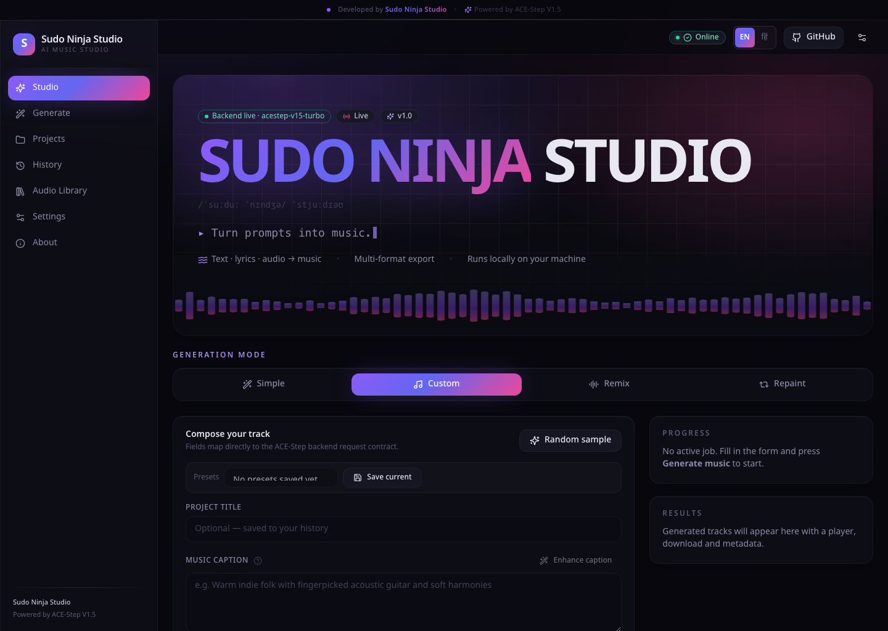
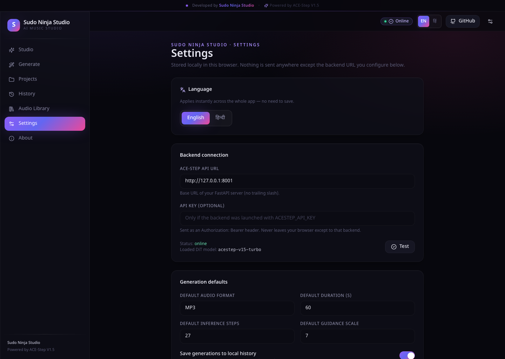
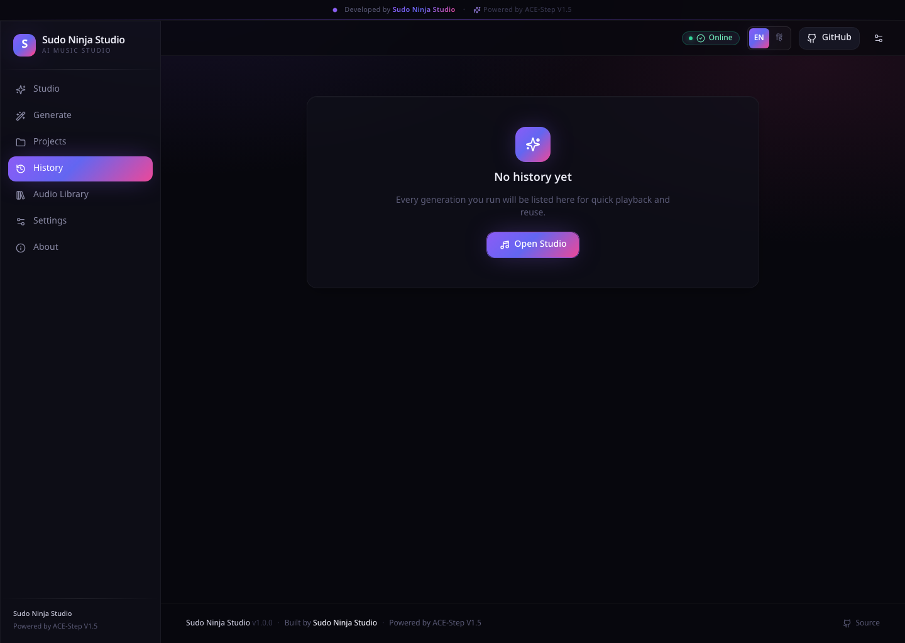
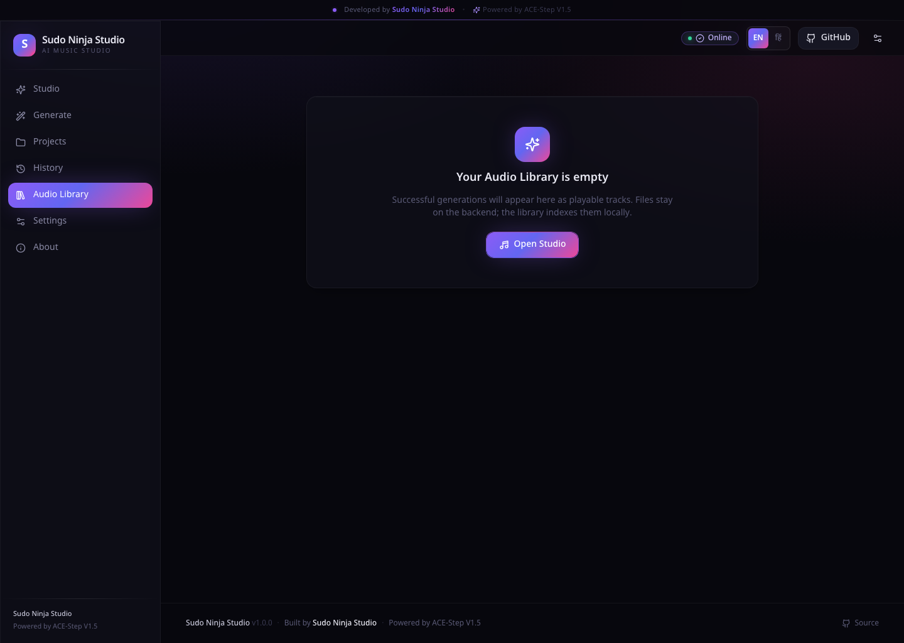
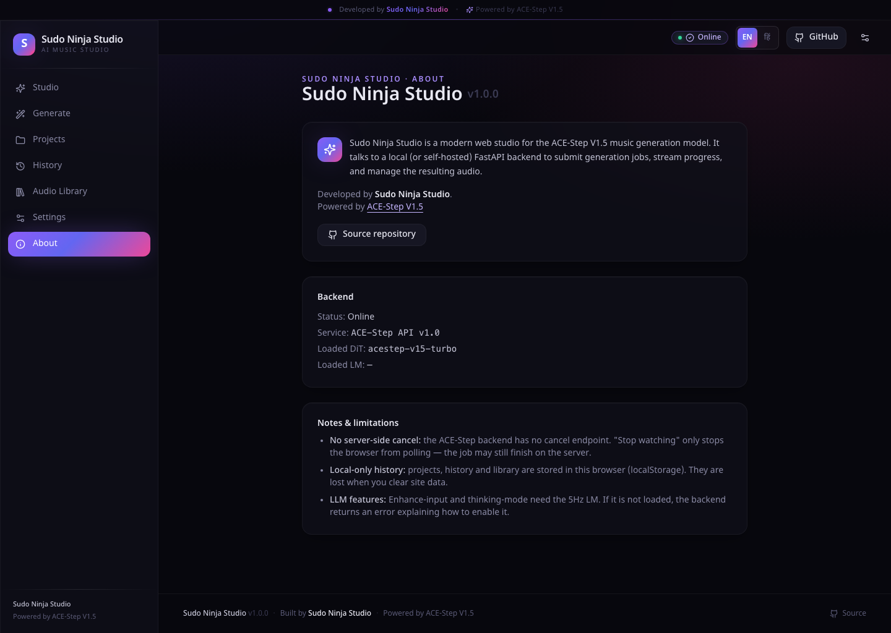
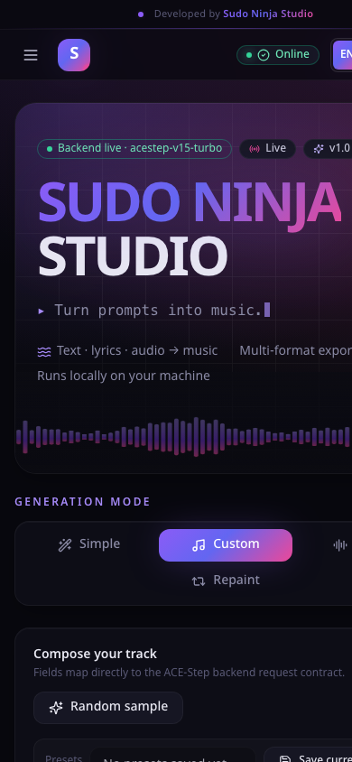

<div align="center">

# 🎛️ Sudo Ninja Studio

**A modern, dark-studio web interface for AI music generation, built on ACE-Step V1.5.**

_Developed by [Sudo Ninja Studio](https://github.com/sudoninja-noob)_

[](https://github.com/sudoninja-noob/sudoninja-studio/actions/workflows/frontend.yml)
[](LICENSE)
[](frontend/)
[](acestep/api_server.py)



</div>

---

## ✨ What is Sudo Ninja Studio?

Sudo Ninja Studio wraps the **ACE-Step V1.5** open-source music-generation model in a polished, browser-based studio experience:

- 🎵 **Text → Music** — describe a song, get a full track
- 🎤 **Lyrics-first workflow** — paste lyrics, get a matching arrangement
- 🎧 **Remix & Repaint** — restyle or regenerate slices of existing audio
- 🎛️ **Complete studio controls** — BPM, key, time signature, guidance, seed, batch
- 🤖 **LLM-assisted** — 5Hz LM enhances captions and lyrics for you
- 🎼 **Live progress** — real-time job status while the model works
- 🗂️ **Local history & library** — every take saved, playable, downloadable

No command line. No Gradio quirks. Just open a browser and make music.

---

## 📸 Screenshots

### Studio — the main workspace
The big animated hero, mode selector, and the full composition form.


### Settings — backend, defaults, local data
Wire the backend, configure defaults, and clear local history.



### History & Library — everything you've made
Every generation is saved locally and playable in place.




### About — honest notes on limits
Version, credits, and what the tool can and can't do.



### Fully responsive
Works on mobile — sidebar collapses to a drawer.



---

## 🚀 Quick start

**One command runs everything:**

```bash
./start.sh
```

That's it. The script:

1. Boots the FastAPI backend (`start_api_server_macos.sh` on macOS, `.sh` on Linux, `.bat` on Windows)
2. Waits for `/health` to respond
3. Installs `frontend/` dependencies on first run (auto-detects Node 18+)
4. Boots the Vite dev server on `http://localhost:5173`
5. Streams both process logs to the terminal
6. On `Ctrl-C`, cleanly stops both

Then open **[http://localhost:5173](http://localhost:5173)** in your browser.

### Manual start (if you prefer)

```bash
# Terminal 1 — backend
./start_api_server_macos.sh     # or start_api_server.sh / start_api_server.bat

# Terminal 2 — frontend
cd frontend
cp .env.example .env.local      # adjust VITE_API_URL if backend is not on :8001
npm install
npm run dev                     # http://localhost:5173
```

### Environment overrides

```bash
NINJA_BACKEND_PORT=8010 ./start.sh          # different backend port
NINJA_FRONTEND_PORT=3000 ./start.sh         # different frontend port
NINJA_SKIP_BACKEND=1  ./start.sh            # just the UI (backend already running)
NINJA_SKIP_FRONTEND=1 ./start.sh            # just the API
NINJA_BACKEND_SCRIPT=./start_api_server_rocm.sh ./start.sh  # custom launcher
```

---

## 🎨 Features at a glance

| Feature | Where | What it does |
|---|---|---|
| **Simple mode** | Studio → Simple | Type a description, LM drafts caption + lyrics + metadata |
| **Custom mode** | Studio → Custom | Full manual control — the default power-user mode |
| **Remix mode** | Studio → Remix | Upload a track, describe a new style, model restyles it |
| **Repaint mode** | Studio → Repaint | Upload a track, regenerate a specific time range |
| **Model picker** | Studio → Advanced | Choose which backend DiT model to use, or leave on Auto |
| **Preset library** | Studio → Presets | Save the whole composition form and reload it in one click (local) |
| **Language (EN / हिं)** | Header toggle | Full English⇄Hindi interface — Studio form, all pages, toasts; choice is remembered |
| **Waveform preview** | Any audio slot | Canvas-rendered mini waveform after upload / record |
| **Mic recording** | Any audio slot | Record directly from your mic (uses `MediaRecorder`) |
| **Drag-and-drop upload** | Any audio slot | Drop `.mp3/.wav/.flac/.ogg/.m4a` files (≤50 MB) |
| **Analyze audio** | Remix/Repaint mode | Detects BPM, key, duration and splashes them into the form |
| **Enhance caption / lyrics** | Studio form | Runs your text through the 5Hz LM for a quality bump |
| **Create sample** | Simple mode | Turns a description into caption+lyrics+metadata via LM |
| **Auto badges** | Optional params | Visual hint showing which fields are auto-inferred |
| **Reset all to Auto** | Optional params | One click clears BPM/Key/TimeSig/Duration/Language |
| **LM code hints** | Advanced | Think, AutoGen, Enhance-input, Retake, Edit toggles |
| **Live progress** | Right panel | Queue position → progress % → stage → elapsed |
| **Cancel / stop watching** | Right panel | Aborts client polling (server has no cancel — noted honestly) |
| **Audio player** | Result card | HTML5 `<audio>` with seek, volume, download |
| **Regenerate / Reuse settings** | Result card | One-click retry with same or restored parameters |
| **Local history & library** | Sidebar | Every run saved to `localStorage`, playable and downloadable |
| **Health-aware status pill** | Header | Pulses green when backend is up, red with tooltip when down |
| **Reduced-motion aware** | Global | All animations respect `prefers-reduced-motion` |
| **Fully responsive** | Global | Mobile drawer sidebar, tablet and desktop layouts |

---

## 🏗️ Architecture

```
┌────────────────────┐    HTTP    ┌───────────────────────────┐
│  Sudo Ninja Studio (SPA)  │ ─────────▶ │  ACE-Step FastAPI backend │
│  React + Vite      │            │  (acestep/api_server.py)  │
│  localhost:5173    │ ◀───────── │  localhost:8001           │
└────────────────────┘   JSON     └───────────────────────────┘
        │                                    │
        ▼                                    ▼
  Local history                       PyTorch / MLX / vLLM
  (localStorage)                      ACE-Step DiT + 5Hz LM
```

**Endpoints consumed** (see [`frontend/src/api/client.ts`](frontend/src/api/client.ts)):

| Endpoint | Purpose |
|---|---|
| `GET  /health`                 | Header status pill, About page |
| `GET  /v1/models`              | Available in client for future model picker |
| `POST /release_task`           | Studio → Generate (JSON or multipart with audio) |
| `POST /query_result`           | Poll task status every 1.5s until terminal |
| `GET  /v1/audio?path=...`      | Stream generated audio files |
| `POST /create_random_sample`   | "Random sample" button |
| `POST /format_input`           | "Enhance caption / lyrics" buttons |
| `POST /v1/create_sample`       | Simple-mode "Create sample from description" |

The request payload mirrors [`GenerateMusicRequest`](acestep/api/http/release_task_models.py) exactly — types live in [`frontend/src/types/api.ts`](frontend/src/types/api.ts).

---

## 📁 Project structure

```
sudoninja-studio/
├── frontend/                     # ⭐ Sudo Ninja Studio SPA
│   ├── src/
│   │   ├── api/                  # Typed HTTP client + polling helper
│   │   ├── components/           # HeroBanner, ModeSelector, AudioSlot, WaveformThumb, TopBanner, …
│   │   ├── hooks/                # useSettings, useHistory, useBackendStatus
│   │   ├── lib/                  # Constants, formatting, cn()
│   │   ├── pages/                # Studio, Projects, History, Library, Settings, About
│   │   ├── styles/               # Tailwind base + component layers
│   │   └── types/                # GenerateMusicRequest, QueryResult, …
│   ├── Dockerfile                # Multi-stage Vite build → Nginx
│   ├── nginx.conf                # SPA fallback + cache headers
│   └── README.md                 # Frontend-specific docs
│
├── acestep/                      # ACE-Step V1.5 backend (upstream)
│   ├── api_server.py             # FastAPI entry
│   ├── api/                      # Routes: /release_task, /query_result, /health, …
│   ├── inference.py, handler.py  # Model orchestration
│   └── …                         # Model, dataset, training, UI code
│
├── docs/
│   ├── screenshots/              # README screenshots (this file)
│   ├── sudo-ninja-user-guide.pdf # 20-page user guide
│   └── ACE-Step-README.md        # Original ACE-Step upstream README
│
├── .github/workflows/frontend.yml  # CI: lint + typecheck + build the frontend
├── docker-compose.sudo-ninja.yml   # Full-stack compose (backend + frontend)
├── docker-compose.yml              # Backend-only compose (upstream)
├── start.sh                        # ⭐ One-command launcher
├── start_api_server_macos.sh       # Backend launcher (Apple Silicon / MLX)
├── start_api_server.sh             # Backend launcher (Linux / CUDA)
└── start_api_server.bat            # Backend launcher (Windows)
```

---

## ⚙️ Configuration

### Frontend (`frontend/.env.local`)

| Variable        | Default                  | Purpose                                                       |
| --------------- | ------------------------ | ------------------------------------------------------------- |
| `VITE_API_URL`  | `http://127.0.0.1:8001`  | ACE-Step backend base URL                                     |
| `VITE_API_KEY`  | *(empty)*                | Optional bearer, only if backend was launched with `ACESTEP_API_KEY` |
| `VITE_REPO_URL` | *(empty)*                | Shown as GitHub button in the header when set                 |

Copy [`frontend/.env.example`](frontend/.env.example) to `frontend/.env.local` — the `start.sh` script does this automatically on first run.

### Backend

The Python service reads its own `.env` and CLI args. See [`docs/ACE-Step-README.md`](docs/ACE-Step-README.md) for the full ACE-Step configuration reference (device, model paths, VRAM tiers, LM backends).

---

## 📖 User guide

A polished 20-page PDF walkthrough lives in [`docs/sudo-ninja-user-guide.pdf`](docs/sudo-ninja-user-guide.pdf). It covers:

1. The interface, region by region
2. When to use Simple / Custom / Remix / Repaint mode
3. Every field, in plain English
4. Your first generation in 90 seconds
5. **The lyrics-first workflow** — how to get tight beats from any lyrics
6. **A best-in-class recommended preset** for high-quality MP3 output
7. Common problems and fixes
8. Sidebar page reference
9. Progression path: beginner to power user

Recommended reading before you start creating tracks in anger.

---

## 🧑‍💻 Development

### Frontend scripts

```bash
cd frontend
npm run dev         # Vite dev server (HMR) on http://localhost:5173
npm run typecheck   # Strict TypeScript project references
npm run lint        # ESLint, max-warnings 0
npm run build       # Type-check + production bundle to dist/
npm run preview     # Serve the built bundle for smoke testing
```

### CI

[`.github/workflows/frontend.yml`](.github/workflows/frontend.yml) runs lint, typecheck, and production build on every push or PR touching `frontend/`, and uploads the `dist/` bundle as an artifact.

### Docker

```bash
# Full stack (frontend + backend). Requires GPU/MPS for the backend.
docker compose -f docker-compose.sudo-ninja.yml up --build

# Frontend only
cd frontend && docker build -t sudo-ninja-frontend .
docker run -p 5173:80 sudo-ninja-frontend
```

---

## 🚢 Deployment

- **Frontend** is a static SPA. Any host that serves `frontend/dist/` with SPA fallback works: Netlify, Vercel, Cloudflare Pages, S3+CloudFront, Nginx, or the included [`frontend/Dockerfile`](frontend/Dockerfile) (Nginx on port 80).
- **Backend needs GPU/MPS/CPU** — GitHub Pages cannot host it. Options:
  - Run locally and set `VITE_API_URL` to your LAN address
  - Deploy to a GPU VM (Runpod, Lambda, Vast.ai, your own server) and point `VITE_API_URL` at its public URL
- **CORS** — the backend currently allows `localhost` / `127.0.0.1` only. If you host the frontend on a different origin, add it to [`acestep/api/route_setup.py`](acestep/api/route_setup.py) (`allow_origins` list).

---

## 🔒 Security & privacy

- No secrets are baked into the frontend bundle. The optional API key is read from `.env.local` (never committed) or from the Settings page and lives in the browser only.
- Uploaded audio is validated by type and size (`≤ 50 MB`, common audio MIME types).
- The backend already restricts `GET /v1/audio` to a whitelisted output directory.
- History, projects, and library are stored in `localStorage` — nothing is sent to a third party.

---

## 🐛 Known limitations

- **No server-side cancel** — the ACE-Step backend has no cancel endpoint. "Stop watching" aborts client polling only; the job continues on the server.
- **Local-only history** — projects, history, and library live in `localStorage`. Clearing site data wipes them (audio files themselves stay on the backend).
- **LLM features** — Enhance / Think / AutoGen need the 5Hz LM. Set `ACESTEP_INIT_LLM=true` when starting the backend if it isn't loaded — the UI surfaces the backend's own error message when it isn't.

---

## 🙏 Credits

- **Sudo Ninja Studio** — frontend, integration, launcher, docs — **[Sudo Ninja Studio](https://github.com/sudoninja-noob)**
- **ACE-Step V1.5** — the underlying music-generation model — **[ACE-Step team](https://github.com/ace-step)**
  ([Project site](https://ace-step.github.io/ace-step-v1.5.github.io/) · [Hugging Face](https://huggingface.co/ACE-Step/Ace-Step1.5) · [Paper](https://arxiv.org/abs/2602.00744))

If you use Sudo Ninja Studio in your work, please credit both.

---

## 📄 License

Apache 2.0 — see [`LICENSE`](LICENSE). ACE-Step V1.5 upstream is Apache 2.0.

---

<div align="center">

**Made with 🎧 by [Sudo Ninja Studio](https://github.com/sudoninja-noob)**

_Star ⭐ this repo if Sudo Ninja Studio helps you make music you love._

</div>
